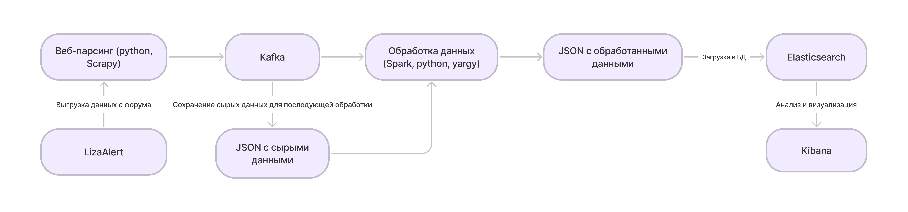

# Lizaalert

Предмет: Наука о данных и аналитика больших объемов информации

Курс: 1 курс магистратуры ВШПИ Политех Петра Великого

Тема: Анализ данных ЛизаАлерт

## Участники
* Брусницына Анна  гр. 3530904/10202
* Шалгуева София   гр. 3530904/10202
* Шаповалова Ирина гр. 3530904/10202

## Архитектура проекта

1. С картиночками и без Spark
   

2. Без картиночек, но со Spark
   